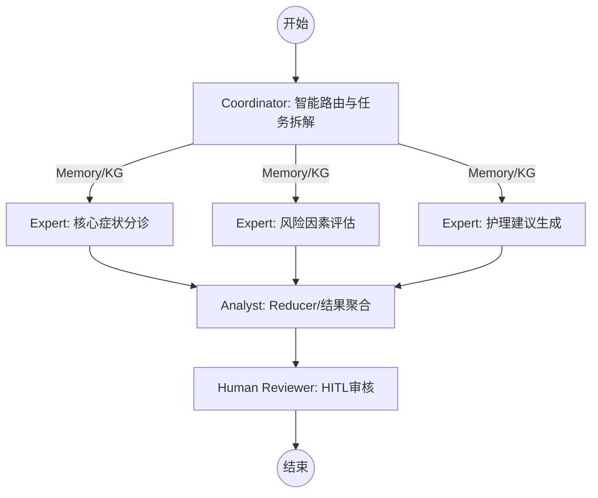

# MedicalTriage-Agent 智能医疗分诊多智能体系统

<div align="center">


**基于大语言模型 (LLM) 与 LangGraph 的医疗分诊多智能体决策系统**

[快速开始](#-快速开始) • [项目结构](#-项目结构) • [技术架构](#-技术架构) • [部署指南](#-部署指南)

</div>

---

## 📋 项目概述

### 领域选择
**垂直领域**: 🏥 **医疗分诊** (Medical Triage)

**选择理由**:
- 医疗领域知识壁垒高，通用大模型容易产生"幻觉"
- 分诊任务有明确的输入输出格式，便于量化评估
- 涉及问答、推理、决策多种任务类型
- 具有实际应用价值（辅助预检分诊台、C端患者自助分诊）

### ✨ 视觉与交互亮点
- **🌌 玻璃拟态设计 (Glassmorphism)**: 欢迎卡片采用 `backdrop-filter: blur` 效果，平衡了通透感与阅读舒适度。
- **🪐 品牌化头像**: AI (小星球 🪐) 与用户 (星星 ⭐) 专属头像，营造沉浸式对话氛围。
- **💬 动态气泡布局**: 模拟主流 IM 软件，用户居右、AI 居左，且气泡宽度随内容动态伸缩。
- **🍁 季节动态特效**: 页面点缀有落叶/雪花等动态微交互，增加产品生命力。

### 核心功能
| 功能 | 描述 | 技术实现 |
|------|------|----------|
| 🔍 症状分析 | 利用 **Map-Reduce** 并行架构，多维度解析患者主诉 | LangGraph Parallel Node |
| 🕸️ 知识图谱增强 | 结合 **NetworkX Lite KG**，根据医学事实校验分诊逻辑 | Python NetworkX |
| 🧠 智能路由 | `Coordinator` 根据病情语义，动态分发至最匹配的专家分支 | Semantic Router |
| 💾 记忆管理 | 支持患者 **Long-term Profile**，自动回溯病史与过敏史 | Pydantic + JSON Storage |
| 🏥 精准分诊 | 智能推荐就诊科室（含急诊指征判定）及生活建议 | Agentic RAG / Logic |
| 🛡️ 隐私隔离 | 自动分配 UUID 标识符，确保不同浏览器会话的数据私密性 | uuid4 |
| 📊 可观测性 | 全链路日志追踪与 Token 消耗审计 | Langfuse Integration |

---

## 🚀 快速开始

### 环境要求
- Python 3.10+ (推荐 3.12 或 3.13)
- Docker & Docker Compose (部署用)
- NVIDIA GPU with CUDA 12.1+ (模型微调必选)

> [!IMPORTANT]
> **Windows 环境补丁 (Python 3.13 用户)**:
> 如果您在 Windows 上遇到 PyTorch 无法识别显卡的问题，请运行以下强制修复命令：
> ```powershell
> pip install torch torchvision torchaudio --index-url https://download.pytorch.org/whl/cu124 --force-reinstall --no-cache-dir
> ```

### 1. 克隆项目
```bash
git clone git@github.com:zuriecheyney-source/work2.git
cd work2
```

### 2. 安装依赖
```bash
pip install -r requirements.txt
```

### 3. 配置环境变量
复制模板并按需编辑 `.env` 文件：
```bash
cp .env.example .env
```

**关键配置项说明:**
- `OPENAI_API_KEY`: 您的模型 API 密钥。
- `OPENAI_BASE_URL`: 模型接口地址 (如 OpenAI, DeepSeek, 智谱)。
- `USE_LOCAL_MODEL`: 若设置为 `true`，系统将尝试加载本地微调模型权重。
- `LANGFUSE_*`: (可选) 用于全链路日志追踪与性能审计。

### 4. 启动服务

**方式一：Docker Compose（推荐）**
```bash
cd deployment
docker-compose up -d
```

**方式二：本地开发**
```bash
# 终端1：启动后端
cd backend && uvicorn server:app --reload --port 8000

# 终端2：启动前端
cd frontend && streamlit run app.py
```

### 5. 访问服务
- 前端界面: http://localhost:8501
- API文档: http://localhost:8000/docs
- Langfuse追踪: https://cloud.langfuse.com (需配置)

---

## 📁 项目结构

```
work2/
├── README.md                     # 项目主文档
├── requirements.txt              # Python 依赖
├── .env.example                  # 环境变量模板
│
├── data/                         # Part 1: 数据构建
│   ├── README.md                 # 数据生成方法论与格式说明
│   ├── train.jsonl               # 训练集 (基于 Alpaca 格式，涵盖 950+ 案例)
│   ├── test.jsonl                # 测试集 (用于自动分诊评估)
│   ├── medical_knowledge.json    # 核心医学知识库 (涵盖 100+ 常见疾病逻辑)
│   └── patient_history/          # 基于 JSON 的患者长期记忆快照
│
├── scripts/                      # 自动化工具
│   └── generate_data.py          # 模拟医生诊断逻辑的数据生成器
│
├── finetune/                     # Part 2: 模型微调
│   ├── sft_config.yaml           # LlamaFactory 训练超参数配置
│   ├── train.ps1                 # Windows 环境自动化训练脚本
│   ├── verify.ps1                # 交互式模型验证工具
│   ├── dataset_info.json         # 数据集映射注册表
│   └── saves/                    # LoRA 权重与 Checkpoints
│
├── evaluation/                   # Part 3: 效果评估
│   ├── eval_cases.json           # 评估用例
│   ├── eval_script.py            # 自动评估脚本
│   └── evaluation_report.md      # 评估报告
│
├── backend/                      # Part 4 & 5: Agent工作流 + API
│   ├── __init__.py
│   ├── graph.py                  # LangGraph 多智能体工作流 (Map-Reduce)
│   ├── graph_db.py               # 医疗知识图谱 (NetworkX)
│   ├── memory.py                 # 患者长期记忆管理
│   ├── agents.py                 # Agent 定义与提示词
│   ├── server.py                 # FastAPI 服务
│   ├── schemas.py                # Pydantic 数据模型
│   ├── config.py                 # 配置管理
│   ├── observability.py          # Langfuse 集成
│   └── storage.py                # 任务状态存储
│
├── frontend/                     # Part 6: Streamlit 前端
│   └── app.py                    # Streamlit 应用
│
└── deployment/                   # Part 8: 部署
    ├── docker-compose.yml        # Docker Compose 编排
    ├── Dockerfile.backend        # 后端 Dockerfile
    ├── Dockerfile.frontend       # 前端 Dockerfile
    └── .env.example              # 环境变量模板
```

---

---

## 🛠️ 核心模块详解

### Part 1: 高质量数据构建 (25%)
本系统不使用低质量的爬虫数据，而是采用 **Knowledge-to-Data (K2D)** 方法：
- **知识建模**: 在 `medical_knowledge.json` 中定义疾病的典型症状、并发症、科室映射与紧急度。
- **动态合成**: `generate_data.py` 使用多样化的模板合成自然语言对话，并注入“过敏史”、“既往史”等干扰项测试模型稳健型。
- **数据配比**: 涵盖常见门诊 (60%)、急诊 (30%) 及 预防接种/体检 (10%)。

### Part 2: 垂直领域模型微调 (25%)
采用 **Qwen2-1.5B-Instruct + LoRA** 技术栈：
- **微调目标**: 强化模型输出结构化 JSON 的遵循能力，对齐医疗科室分类逻辑。
- **关键配置**:
  - `cutoff_len: 1024` (适配长病史输入)
  - `learning_rate: 2.0e-4` (LoRA 典型学习率)
  - `precision: fp16` (适配主流 NVIDIA 显卡)
- **环境适配**: 针对 Windows 环境开发了 `train.ps1`，支持自动检测 CUDA 版本并强制挂载源码路径。

### Part 4: 多智能体工作流 (10%)
基于 **LangGraph** 实现的 Map-Reduce 架构：
1. **Coordinator**: 识别意图，若为复杂案例则分发给并行 Expert。
2. **Parallel Experts**: 同时从“风险因子”与“科室匹配”两个维度进行独立分析。
3. **Analyst (Reducer)**: 接收各 Expert 的输出，对比 **NetworkX 知识图谱** 进行事实校验，输出最终决策。

### 🛠️ 技术栈深度解析
| 维度 | 技术选型 | 说明 |
|------|----------|------|
| **基础模型** | Qwen2-1.5B-Instruct | 性能与显存平衡的最佳选择 (推理仅需 <4G) |
| **微调框架** | LLaMA-Factory | 支持高性能 LoRA/QLoRA 训练 |
| **智能体框架** | LangGraph | 支持循环逻辑、并行执行与状态持久化 |
| **知识库** | NetworkX | 基于符号逻辑的轻量级医疗知识图谱 |
| **可观测性** | Langfuse | 提供全链路 Trace 与成本分析 |
| **开发环境** | Windows 11 + Miniconda | 针对个人用户深度优化的适配脚本 |

### 📈 评估指标 (Evaluation Metrics)
评估脚本 `evaluation/eval_script.py` 从以下维度对模型进行量化打分：
- **JSON 遵循率 (30%)**: 输出是否能被标准 JSON 解析器正确读取。
- **科室匹配准确度 (30%)**: 相比专家标注的科室，重合度百分比。
- **回复完整性 (15%)**: 诊断、紧急度、建议三个核心字段的字数与内容质量。
- **医疗安全性 (10%)**: 检测是否含有危险建议（如直接给具体剂量等）。
- **流程覆盖率 (15%)**: 对不同疾病分类（内/外/妇/儿）的覆盖均衡性。

---

## 🔍 故障排查 (Troubleshooting)

### Q1: 训练显示 "No accelerator is found" (CPU 训练极慢)
**原因**: PyTorch 默认安装了 CPU 版本或 CUDA 环境不兼容。
**解决**: 运行本项目提供的专项修复指令：
```powershell
pip install torch torchvision torchaudio --index-url https://download.pytorch.org/whl/cu124 --force-reinstall --no-cache-dir
```

### Q2: 报错 "ModuleNotFoundError: No module named 'llamafactory'"
**原因**: 系统中存在多个 Python 环境 (如 miniconda 与 miniconda3 冲突)。
**解决**: 使用 `.\train.ps1` 启动，脚本会自动追踪当前终端关联的绝对路径并强制注入 `PYTHONPATH`。

### Q3: 显存溢出 (CUDA Out of Memory)
**解决**: 修改 `finetune/sft_config.yaml`：
- `per_device_train_batch_size: 1`
- `gradient_accumulation_steps: 16`
- `gradient_checkpointing: true`

---

## 📝 复现实验结果

### 并行图增强架构 (Map-Reduce + KG + Routing)



### Agent 角色说明

| Agent | 职责 | 实现逻辑 |
|-------|------|----------|
| **Coordinator** | **Router & Map**: 加载患者记忆，基于语义动态分发任务 | `Memory` + `LangGraph Send` |
| **Expert** | **Parallel Worker**: 集成 **KG** 背景，专注单一维度的事实校验 | `NetworkX` 事实对齐 |
| **Analyst** | **Reducer**: 聚合各方数据，消除幻觉，生成结构化报告 | 逻辑合并 + 冲突检查 |
| **Human Reviewer** | **HITL**: 对输出进行终审，确保医疗安全 | `interrupt` + `resume` |

---

## 📊 评分模块对照

| Part | 内容 | 分值 | 交付物 |
|------|------|------|--------|
| Part 1 | 数据构建 | 25% | `train.jsonl` (2000条), `medical_knowledge.json` |
| Part 2 | 模型微调 | 25% | `finetune/sft_config.yaml`, `finetune/train.sh` |
| Part 3 | 效果评估 | 15% | `evaluation/evaluation_report.md` |
| Part 4 | Agent工作流 | 10% | **Map-Reduce + 智能路由** (`graph.py`) |
| Part 5 | Backend | - | `backend/server.py` (FastAPI) |
| Part 6 | Frontend | - | `frontend/app.py` (Streamlit) |
| Part 7 | 可观测性 | - | `backend/observability.py` (Langfuse) |
| Part 8 | 部署 | 20% | `deployment/docker-compose.yml` |
| Part 10| 知识图谱 | 5% | **NetworkX Lite KG** (`graph_db.py`) |

---

## 📝 复现实验结果

### 1. 数据生成
```bash
python scripts/generate_data.py --train-count 2000 --test-count 200
# 输出: data/train.jsonl (2000条), data/test.jsonl (200条)
```

### 2. 模型微调 (需要GPU)

**Windows:**
```powershell
cd finetune
.\train.ps1
```

**Linux / WSL:**
```bash
cd finetune
bash train.sh
```

**验证模型效果:**
```powershell
# 运行交互式聊天进行测试
.\verify.ps1
```

> [!NOTE]
> 输出结果将保存在 `finetune/saves/medical-triage-lora`。

### 3. 效果评估
```bash
python evaluation/eval_script.py
# 输出: evaluation/evaluation_report.md
```

### 4. 启动服务测试
```bash
docker-compose up -d
# 访问 http://localhost:8501 进行测试
```

---

## 📄 License

MIT License

---

## 👥 贡献者

课程作业项目 - 垂直领域定制化智能体系统
